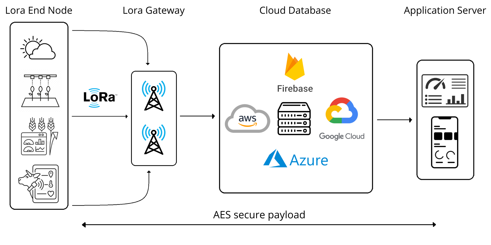
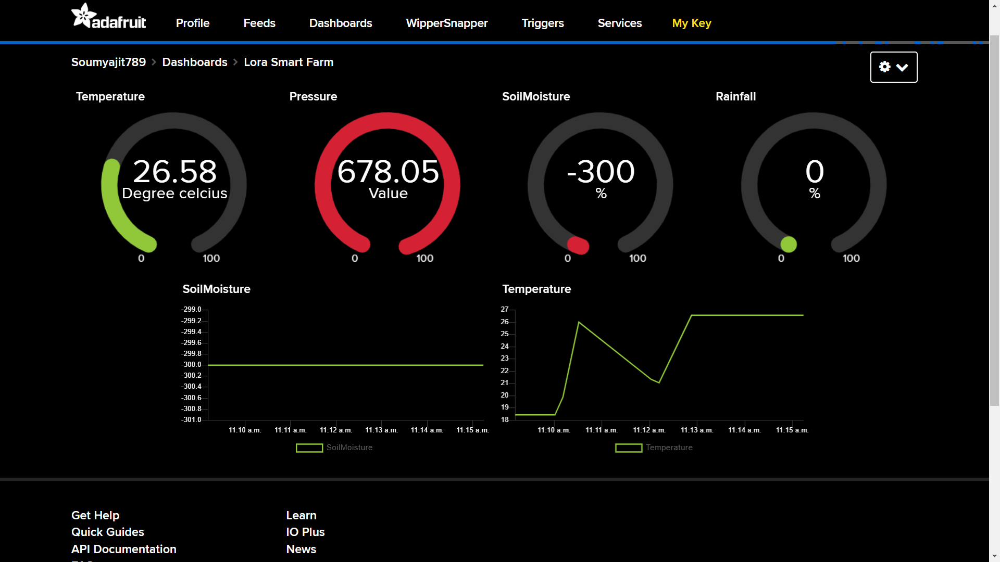

# Lorawan-Smart-Farming-with-Data-visualisation
The Internet of Things (IoT) is omnipresent, also in the farming domain, and plays a vital role in the life of everyone. As the population increases over the forthcoming decade, food production will have to shoot up. Smart Farming or agriculture is one of all the methodologies that one can adopt. The applications embrace intelligent monitoring, sensing, irrigation systems, fertilization systems, etc. The objective is to get farmer-friendly, inexpensive, compatible, low power consumption, and significantly a long-range wide area network (LoRaWAN) platform-LoRaWAN based IoT intelligent farming systems. The creative use of LoRaWAN technology can make intelligent agricultural systems efficient, economical, durable, energy-saving, and adaptable has been discussed in this article. This paper aims to provide overall architecture with the help of LoRaWAN and how this system would be helpful over some of the systems presently used.

## Why lora?
LoRa is a wireless modulation technique derived from Chirp Spread Spectrum (CSS) technology. It encodes information on radio waves using chirp pulses - similar to the way dolphins and bats communicate! LoRa modulated transmission is robust against disturbances and can be received across great distances.

LoRa is ideal for applications that transmit small chunks of data with low bit rates. Data can be transmitted at a longer range compared to technologies like WiFi, Bluetooth or ZigBee. These features make LoRa well suited for sensors and actuators that operate in low power mode.

https://www.thethingsnetwork.org/docs/lorawan/what-is-lorawan/

## PROTOTYPE IMPLEMENTATION

In the case of hardware for collecting data from soil and various other environment variables, we create Lora gateway and Lora end node with the help of ESP32 and SX1278 Ra-02 Lora modules.

In this project we have used BMP280 for temperature, pressure and altitude monitoring (BME680 is the best as it also includes pollution and humidity monitoring),soil moisture for measuring moisture content in the soil and rain sensor to detect rain.
Here we have used Adafruit IO to get information from lora gateway and create our own dashboard.

